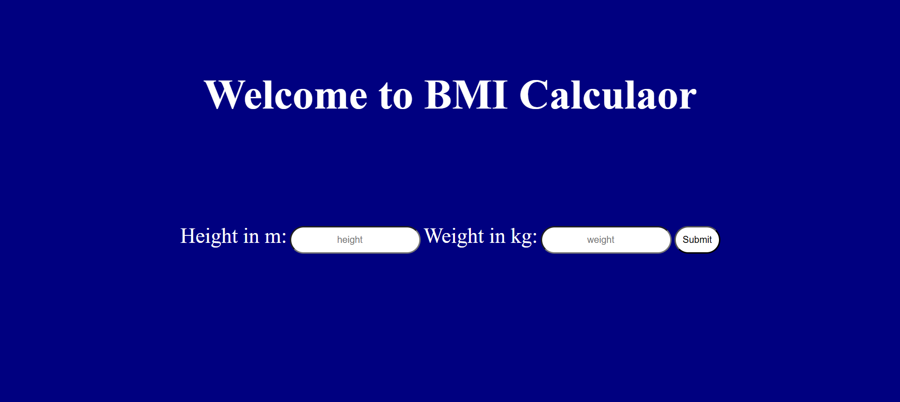
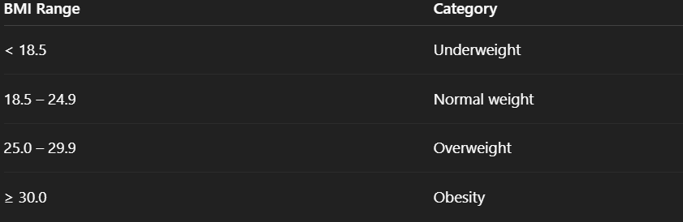

# BMI Calculator

  

Simple Body Mass Index (BMI) App

## Table of Contents

- [About The Project](#about-the-project)
- [Features](#features)
- [Getting Started](#getting-started)
  - [Prerequisites](#prerequisites)
  - [Installation](#installation)
- [License](#brand-name-generator)
- [Contact](#contact)

## About The Project

A simple **Body Mass Index (BMI)** calculator built with Node.js, Express, and EJS. This app accepts weight and height from the user, computes the BMI, and classifies it into standard health categories.



## Features

The key features and functionalities of the project.

- Feature 1: Built using **Node.js** and **Express**
- Feature 2: Uses **EJS** templating engine to render views
- Feature 3: Calculates BMI:  
  \[
  BMI = weight (kg)/(height (m))^2
  \]
- Feature 4: Provides health category feedback:
  - Underweight
  - Normal weight
  - Overweight
  - Obesity

## Getting Started

This section will guide users on how to set up your project locally.

### Prerequisites

Software, libraries, or tools that need to be installed before running your project.

- `npm`
  ```sh
  npm install npm@latest -g
  ```
- Git
- Node.js

### Installation

Step-by-step instructions on how to get your development environment running.

1.  Clone the repo
    ```sh
    git clone https://github.com/PrarabdhSoni/bmi-calculator.git
    ```
2.  Navigate into the project directory
    ```sh
    cd bmi-calculator
    ```
3.  Install dependencies (example for Node.js/Python)

    ```sh
    npm install

    ```

4.  Start the server

    ```sh
    node index.js

    ```

## Usage

- Enter your weight in kilograms.

- Enter your height in centimeters.

- Click Calculate BMI.

- View your BMI and health category.

## Common Error Fix

1.  If you get this error:

    ```sh
    Error: Cannot find module 'ejs'

    ```

2.  Install the missing dependency:

    ```sh
    npm install ejs

    ```

    Then restart your server.

## 📐 BMI Formula

1.  Metric standard:

    ```sh
    BMI = weight (kg) / (height (m) × height (m))

    ```

2.  Interpretation Table:
    

## Contact

Feel free to contact me 😊

- Email: prarabdhsoni1@gmail.com
- Linkedin: https://linkedin.com/in/prarabdh-soni
